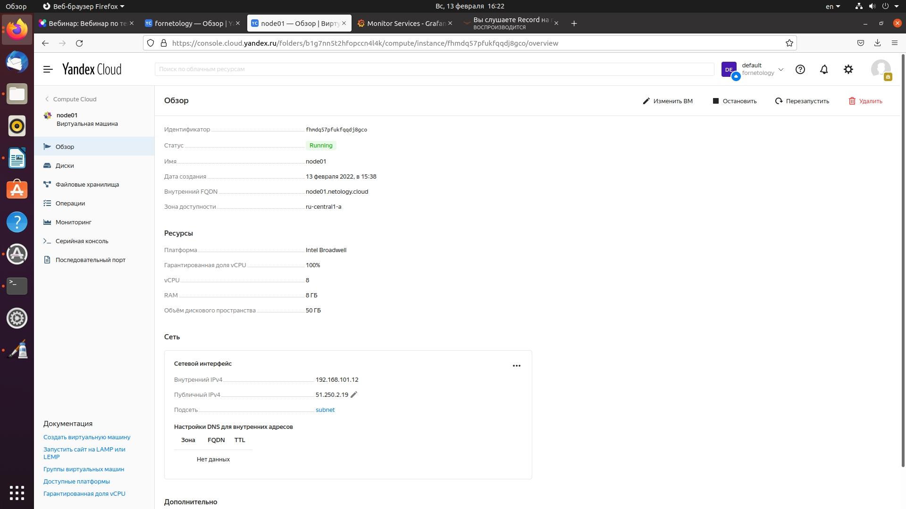
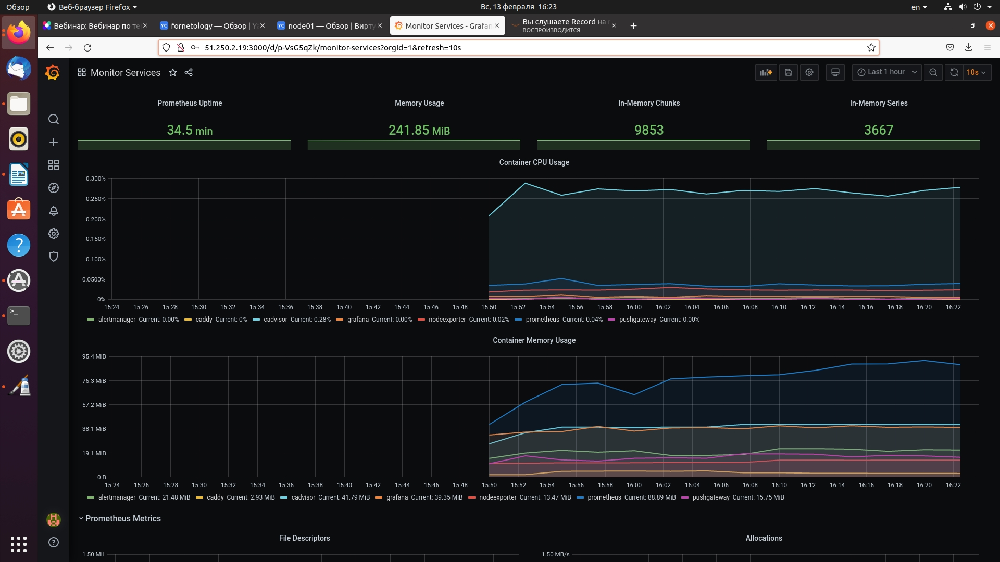
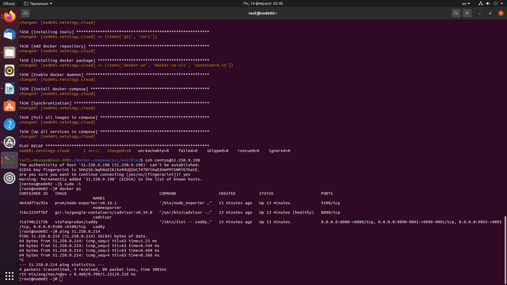
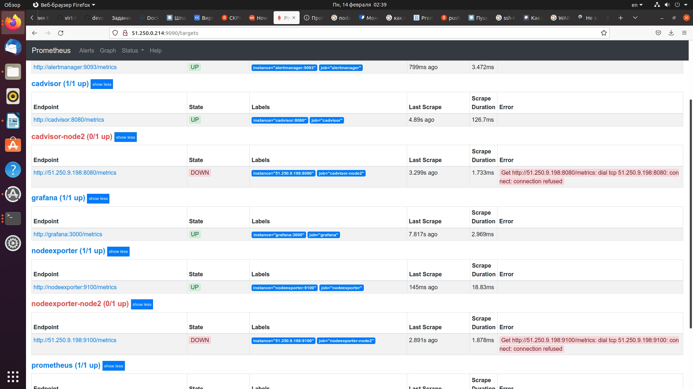

## **Задача 1. Создать собственный образ операционной системы с помощью Packer.**

## **Задача 2. Создать вашу первую виртуальную машину в Яндекс.Облаке.**

## **Задача 3. Создать ваш первый готовый к боевой эксплуатации компонент мониторинга, состоящий из стека микросервисов.**

## **Задача 4. Создать вторую ВМ и подключить её к мониторингу развёрнутому на первом сервере.**
```
Создал конфигурацию несколько раз снова. Но не получилось передать данные со второй ВМ. Обе ВМ создаются, пингуются между собой, докер-контейнеры работают. Но почему-то данные с node2 не попадают в прометеус node1. Скриншоты прилагаю.
```


```
При этом данные которые собираются локально на node1 без ошибок попадают в прометеуг а затем в графану.
```
