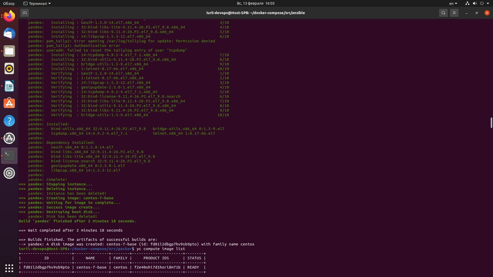

## **Задача 1. Создать собственный образ операционной системы с помощью Packer.**
```

```
## **Задача 2. Подходит ли в этом сценарии использование Docker контейнеров или лучше подойдет виртуальная машина, физическая машина?**
```
```
