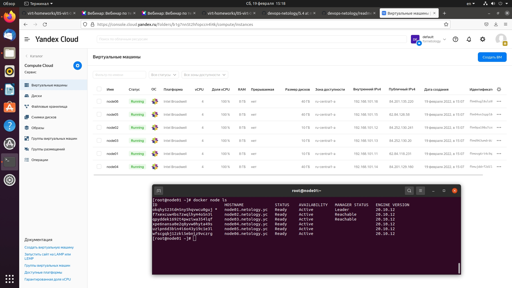
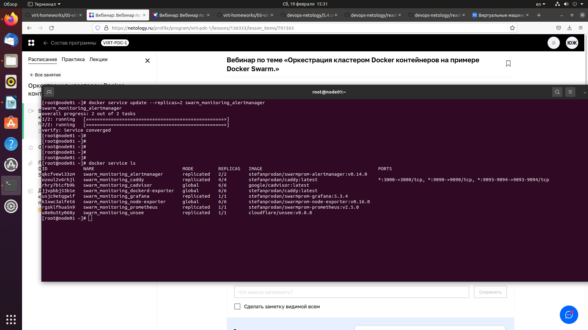

## **Задача 1.**
#### В чём отличие режимов работы сервисов в Docker Swarm кластере: replication и global?
```
Режим replication значит, что микросервис будет запущен на мною заданном количестве нод кластера.
Режим global значит, что микросервис будет запущен на всех нодах кластера.
```
#### Какой алгоритм выбора лидера используется в Docker Swarm кластере?
```
Для выбора лидера используется алгоритм Ralf (алгоритм поддержания распределенного консенсуса). 
Грубо говоря ноды голосованием выбирают лидера, лидер в моменте может быть только один. 
```
#### Что такое Overlay Network?
```
Это сеть которая даёт нашему кластеру единое пространство dns имён.
```
## **Задача 2. Создать ваш первый Docker Swarm кластер в Яндекс.Облаке.**

## **Задача 3. Создать ваш первый, готовый к боевой эксплуатации кластер мониторинга, состоящий из стека микросервисов.**

## **Задача 4. Выполнить на лидере Docker Swarm кластера команду и дать письменное описание её функционала, что она делает и зачем она нужна:**
#### docker swarm update --autolock=true
```
При перезапуске docker в память каждого узла загружаются как ключ TLS, 
используемый для шифрования связи между узлами swarm, так и ключ, 
используемый для шифрования и дешифрования данных конфигурации. 
С посмощью команды docker swarm update --autolock=true 
мы может защитить два секретных ключа.

Когда включена автоблокировка, Docker требует сначала разблокировать кластер, 
используя ключ шифрования, сгенерированный Docker, когда кластер был заблокирован.
И только после разблокировки нам станет доступно управление кластером.

Также при создании бэкапов и восстановлении кластера потребуется данный ключ
ручной разблокировки.
```
