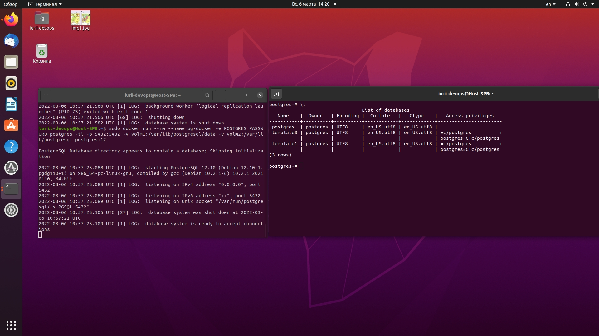
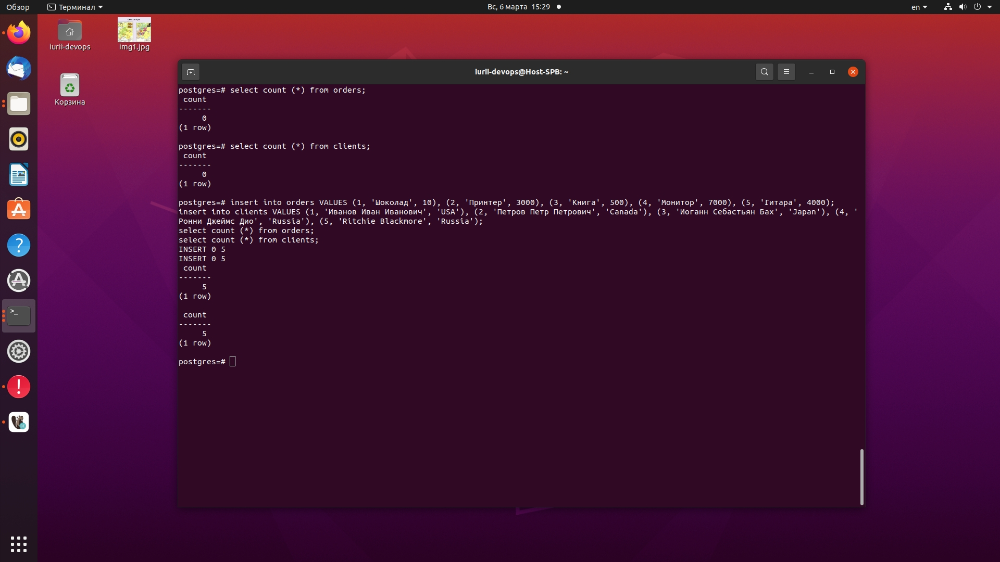
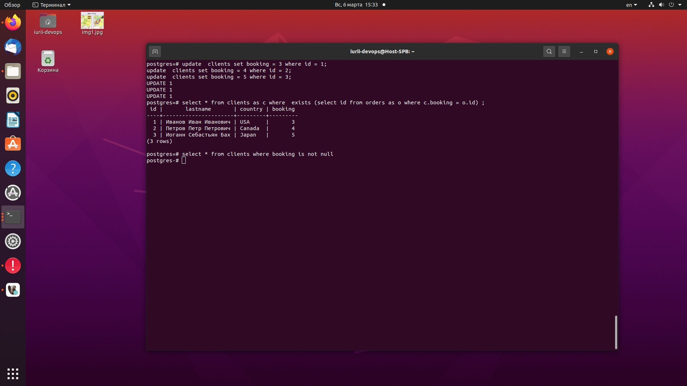

## **Задача 1.**
#### Используя docker поднимите инстанс PostgreSQL (версию 12) c 2 volume, в который будут складываться данные БД и бэкапы.

## **Задача 2.**
#### Итоговый список БД, описание таблиц (describe) SQL-запрос для выдачи списка пользователей с правами над таблицами test_db, список пользователей с правами над таблицами test_db.
```
CREATE DATABASE test_db
CREATE ROLE "test-admin-user" SUPERUSER NOCREATEDB NOCREATEROLE NOINHERIT LOGIN;

CREATE TABLE orders 
(
id integer, 
name text, 
price integer, 
PRIMARY KEY (id) 
);

CREATE TABLE clients 
(
	id integer PRIMARY KEY,
	lastname text,
	country text,
	booking integer,
	FOREIGN KEY (booking) REFERENCES orders (Id)
);

CREATE ROLE "test-simple-user" NOSUPERUSER NOCREATEDB NOCREATEROLE NOINHERIT LOGIN;
GRANT SELECT ON TABLE public.clients TO "test-simple-user";
GRANT INSERT ON TABLE public.clients TO "test-simple-user";
GRANT UPDATE ON TABLE public.clients TO "test-simple-user";
GRANT DELETE ON TABLE public.clients TO "test-simple-user";
GRANT SELECT ON TABLE public.orders TO "test-simple-user";
GRANT INSERT ON TABLE public.orders TO "test-simple-user";
GRANT UPDATE ON TABLE public.orders TO "test-simple-user";
GRANT DELETE ON TABLE public.orders TO "test-simple-user";
```

## **Задача 3.**
#### Используя SQL синтаксис: вычислите количество записей для каждой таблицы. Приведите в ответе: запросы, результаты их выполнения.
```
insert into orders VALUES (1, 'Шоколад', 10), (2, 'Принтер', 3000), (3, 'Книга', 500), (4, 'Монитор', 7000), (5, 'Гитара', 4000);
insert into clients VALUES (1, 'Иванов Иван Иванович', 'USA'), (2, 'Петров Петр Петрович', 'Canada'), (3, 'Иоганн Себастьян Бах', 'Japan'), (4, 'Ронни Джеймс Дио', 'Russia'), (5, 'Ritchie Blackmore', 'Russia');
select count (*) from orders;
select count (*) from clients;
```

## **Задача 4.**
#### Используя foreign keys свяжите записи из таблиц, согласно таблице. Приведите SQL-запросы для выполнения данных операций. Приведите SQL-запрос для выдачи всех пользователей, которые совершили заказ, а также вывод данного запроса.
```
update  clients set booking = 3 where id = 1;
update  clients set booking = 4 where id = 2;
update  clients set booking = 5 where id = 3;
```

## **Задача 5.**
#### Получите полную информацию по выполнению запроса выдачи всех пользователей из задачи 4 (используя директиву EXPLAIN). Приведите получившийся результат и объясните что значат полученные значения.
```

```
## **Задача 6.**
#### Создайте бэкап БД test_db и поместите его в volume, предназначенный для бэкапов. Восстановите БД test_db в новом контейнере. Приведите список операций, который вы применяли для бэкапа данных и восстановления.
```

```
