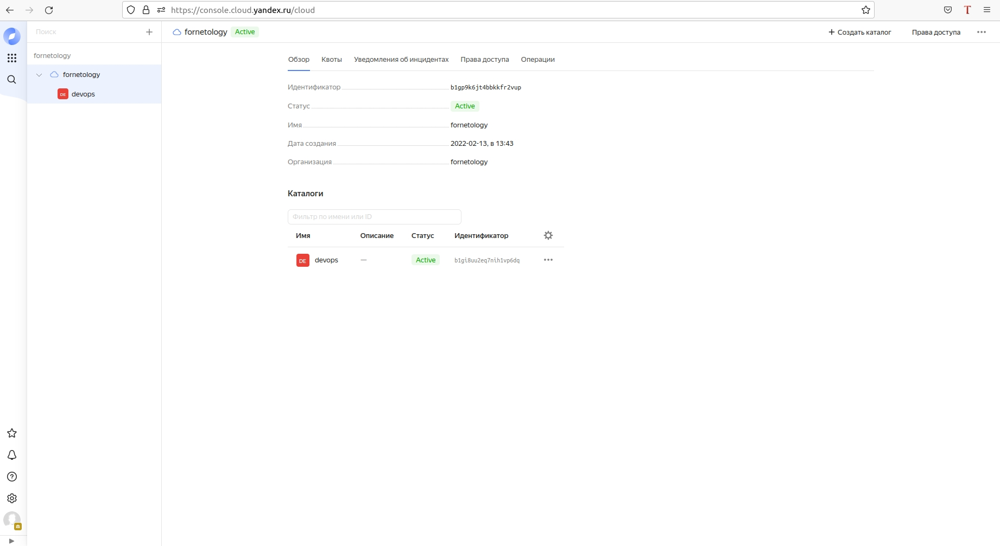
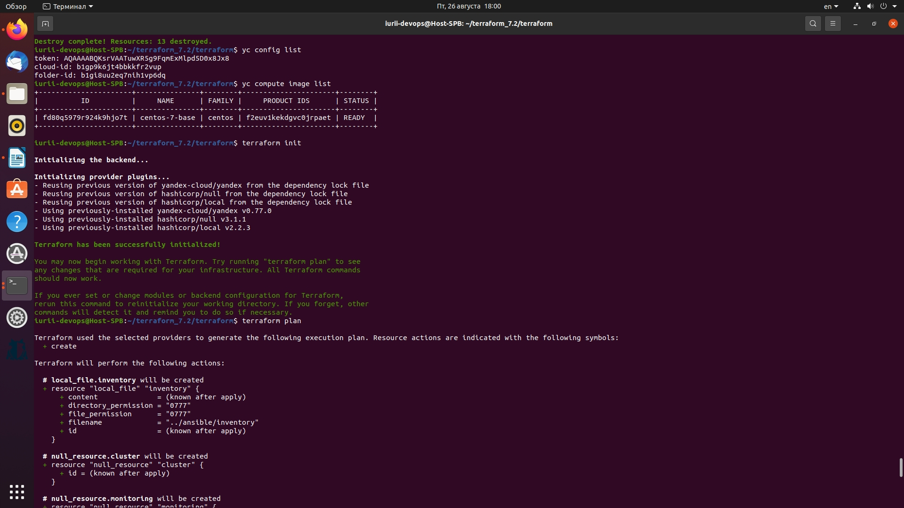

## **Задача 1 (Вариант с Yandex.Cloud).**
#### Регистрация в ЯО и знакомство с основами.

## **Задача 2.** 
#### Создание yandex_compute_instance через терраформ.

#### При помощи какого инструмента (из разобранных на прошлом занятии) можно создать свой образ?
```
Для создания образа использовал утилиту Packer. Используется последовательность:
1. Подключаемся к ус
2. Создаём временную сеть и подсеть
3. Создаём файл конфигурации centos-7-base.json
4. Проверяем валидность настроек в файле и запускаем - packer build
5. Проверяем наличие образа командой - yc compute image list
6. Удаляем временную сеть и подсеть
```
#### Ссылка на репозиторий с исходной конфигурацией терраформа:
```
Файлы приложены в репозиторий.
Также дополнительно создаётся файл key.json для авторизации через сервисный аккаунт 
(так нет необходимости использовать секретные ключи в коде terraform). 
Сервисному аккаунт присваевается роль - admin.
```
