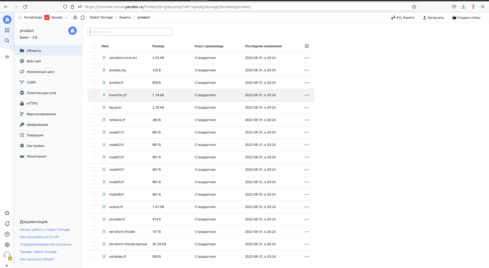
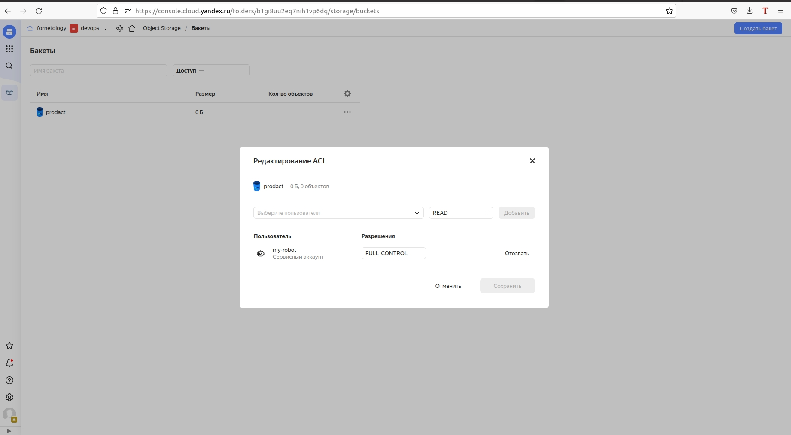

## **Задача 1.**
#### Создайте s3 бакет, iam роль и пользователя от которого будет работать терраформ. 
#### Зарегистрируйте бэкэнд в терраформ проекте как описано по ссылке выше.
#### Можно создать отдельного пользователя, а можно использовать созданного в рамках предыдущего задания, просто добавьте ему необходимы права.


## **Задача 2.** 
#### Инициализируем проект и создаем воркспейсы.
```
iurii-devops@Host-SPB:~/terraform_7.2/terraform$ terraform workspace new notest
iurii-devops@Host-SPB:~/terraform_7.2/terraform$ terraform workspace new test
iurii-devops@Host-SPB:~/terraform_7.2/terraform$ terraform workspace select test
```
#### Вывод команды terraform workspace list:
```
iurii-devops@Host-SPB:~/terraform_7.2/terraform$ terraform workspace list
  default
  notest
* test
```
#### Вывод команды terraform plan для воркспейса test:
```
iurii-devops@Host-SPB:~/terraform_7.2/terraform_notest/terraform/demo$ terraform plan

Terraform used the selected providers to generate the following execution plan.
Resource actions are indicated with the following symbols:
  + create
 <= read (data resources)

Terraform will perform the following actions:

  # module.news.data.yandex_compute_image.image will be read during apply
  # (config refers to values not yet known)
 <= data "yandex_compute_image" "image"  {
      + created_at    = (known after apply)
      + description   = (known after apply)
      + family        = "centos-7"
      + folder_id     = (known after apply)
      + id            = (known after apply)
      + image_id      = (known after apply)
      + labels        = (known after apply)
      + min_disk_size = (known after apply)
      + name          = (known after apply)
      + os_type       = (known after apply)
      + product_ids   = (known after apply)
      + size          = (known after apply)
      + status        = (known after apply)
    }

  # module.news.yandex_compute_instance.instance[0] will be created
  + resource "yandex_compute_instance" "instance" {
      + created_at                = (known after apply)
      + description               = "News App Demo"
      + folder_id                 = "b1gi8uu2eq7nih1vp6dq"
      + fqdn                      = (known after apply)
      + hostname                  = "news-1"
      + id                        = (known after apply)
      + metadata                  = {
          + "ssh-keys" = <<-EOT
                centos:ssh-rsa AAAAB3NzaC1yc2EAAAADAQABAAABgQDSM9a3wkbMGu6jv1eV3kTe21hlnze4QzIe90Bl+c2uwR+/zh2Io9fbTBFB4JtmC1nTZe6gb1MYZXk2cUwz0vdkMTw8d1zR8iu/sdNLMoAsXlvpIJm9Vs+RNiCDItdgGFehoSrczRJdFYOmYzzMkIUN+ktE28chVAil7dvPqL2BS9Wk+nFH+lQVaSwk8OB6lT59ghDIm+evntea5eXqsrb+jc19wkNBofGEvxAV+FTIhFQKEEBdyQI9Imofw4vW/W7/C9kGyp+d5f8nFxxKI9ilfMgYJtXi/j2Q1xm+bjmJWZYeSl76pdUVq2MTu7/0Jad/9ixmZBrh+yu2VJ2ixb8erDlwa+OfX7SV1TD16TZFQwDY6mw6Y29Wlm4/R9wUVDZZDFjEjzCo8Rat9c2op5af0HZhDlZKC5NH8gV8i6gK+9FFYK60q8/OYTASHLXj+9f5pk0AYxL1wwl1BII7hMn/ZloOgQmP2bsx9XA54zE9oUTQQKTVuUJ2BWsOG0iTfMc= iurii-devops@Host-SPB
            EOT
        }
      + name                      = "news-1"
      + network_acceleration_type = "standard"
      + platform_id               = "standard-v2"
      + service_account_id        = (known after apply)
      + status                    = (known after apply)
      + zone                      = "ru-central1-a"

      + boot_disk {
          + auto_delete = true
          + device_name = (known after apply)
          + disk_id     = (known after apply)
          + mode        = (known after apply)

          + initialize_params {
              + description = (known after apply)
              + image_id    = (known after apply)
              + name        = (known after apply)
              + size        = 20
              + snapshot_id = (known after apply)
              + type        = "network-ssd"
            }
        }

      + network_interface {
          + index              = (known after apply)
          + ip_address         = (known after apply)
          + ipv4               = true
          + ipv6               = (known after apply)
          + ipv6_address       = (known after apply)
          + mac_address        = (known after apply)
          + nat                = true
          + nat_ip_address     = (known after apply)
          + nat_ip_version     = (known after apply)
          + security_group_ids = (known after apply)
          + subnet_id          = (known after apply)
        }

      + placement_policy {
          + placement_group_id = (known after apply)
        }

      + resources {
          + core_fraction = 100
          + cores         = 2
          + memory        = 2
        }

      + scheduling_policy {
          + preemptible = (known after apply)
        }
    }

  # module.vpc.yandex_vpc_network.this will be created
  + resource "yandex_vpc_network" "this" {
      + created_at                = (known after apply)
      + default_security_group_id = (known after apply)
      + description               = "managed by terraform default network"
      + folder_id                 = "b1gi8uu2eq7nih1vp6dq"
      + id                        = (known after apply)
      + name                      = "default"
      + subnet_ids                = (known after apply)
    }

  # module.vpc.yandex_vpc_subnet.this["ru-central1-a"] will be created
  + resource "yandex_vpc_subnet" "this" {
      + created_at     = (known after apply)
      + description    = "managed by terraform default subnet for zone ru-central1-a"
      + folder_id      = "b1gi8uu2eq7nih1vp6dq"
      + id             = (known after apply)
      + name           = "default-ru-central1-a"
      + network_id     = (known after apply)
      + v4_cidr_blocks = [
          + "10.128.0.0/24",
        ]
      + v6_cidr_blocks = (known after apply)
      + zone           = "ru-central1-a"
    }

Plan: 3 to add, 0 to change, 0 to destroy.

───────────────────────────────────────────────────────────────────────────────

Note: You didn't use the -out option to save this plan, so Terraform can't
guarantee to take exactly these actions if you run "terraform apply" now.
iurii-devops@Host-SPB:~/terraform_7.2/terraform_notest/terraform/demo$ 
```
