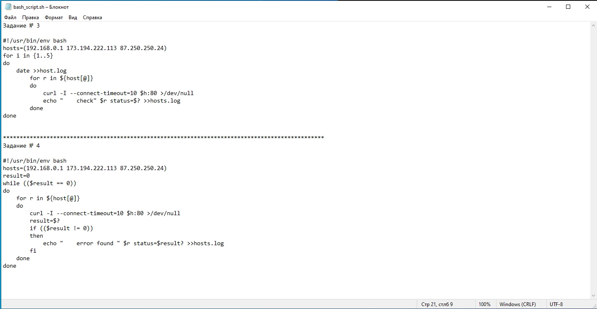

## **Задание 1**

## **Задание 2**

### **Не правильный скрипт:**
##### while ((1==1)
##### do
##### curl https://localhost:4757
##### if (($? != 0))
##### then
##### date >> curl.log
##### fi
##### done
***
### **Исправленный скрипт**
##### while ((1==1)) *[добавил скобочку]*
##### do
##### curl https://localhost:4757
##### if (($? != 0))
##### then
##### date >> curl.log
##### else *[добавил условие, чтобы скрипт завершился когда сайт станет доступным]*
##### exit
##### fi
##### sleep 5 *[добавил тайминг выполнения, чтобы не забивался log файл]*
##### done

## **Задание 3 и задание 4**

