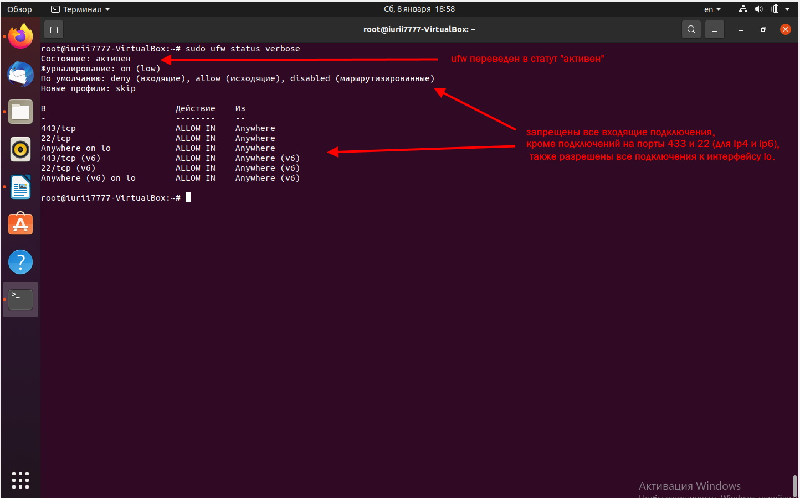
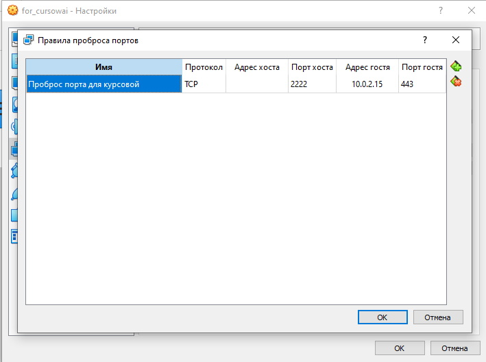
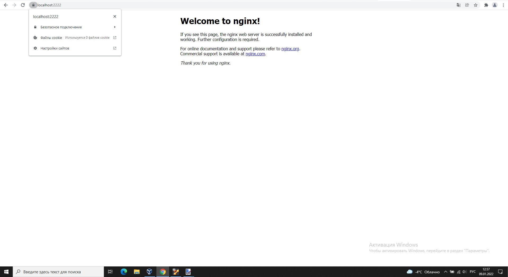
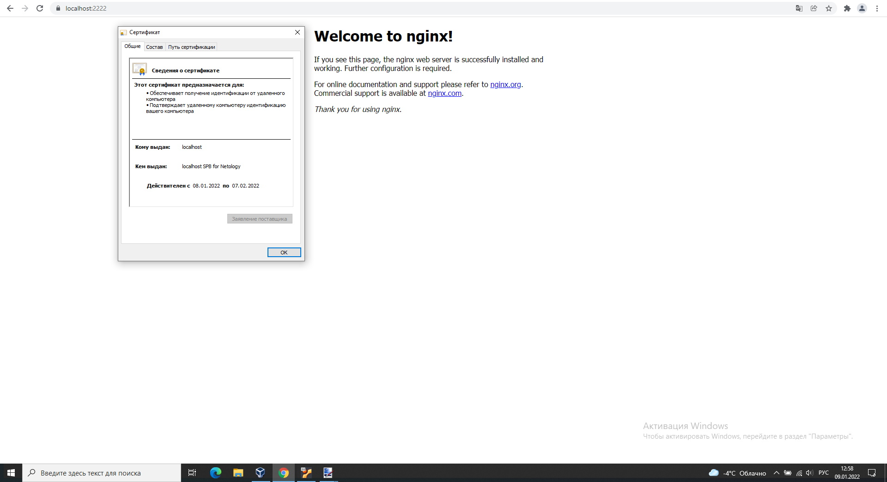
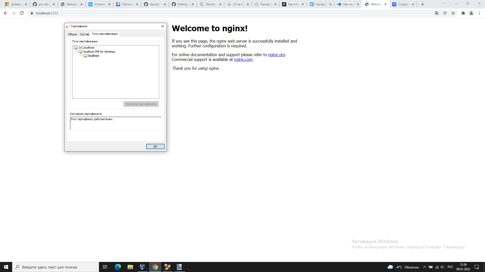
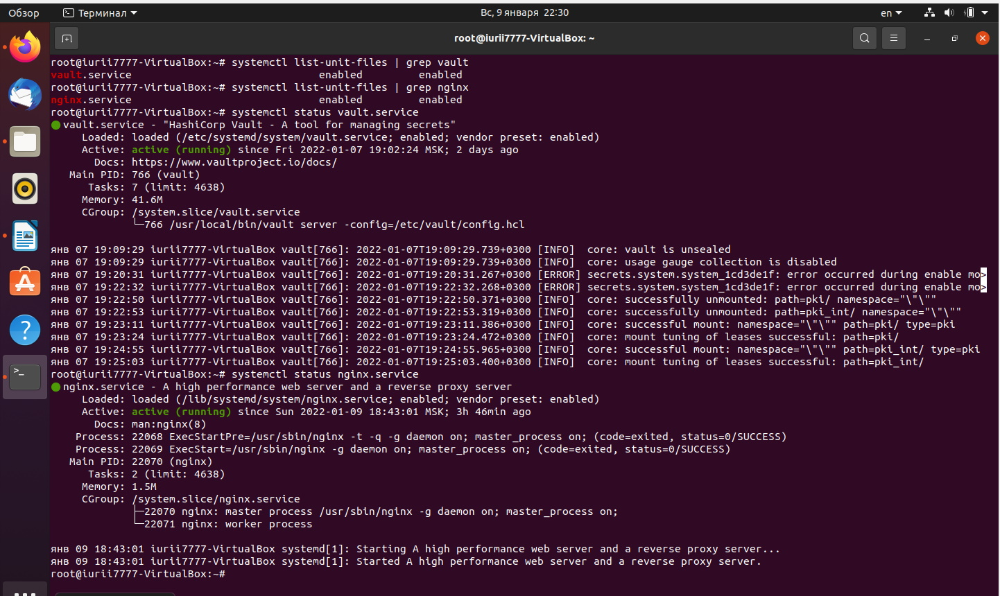
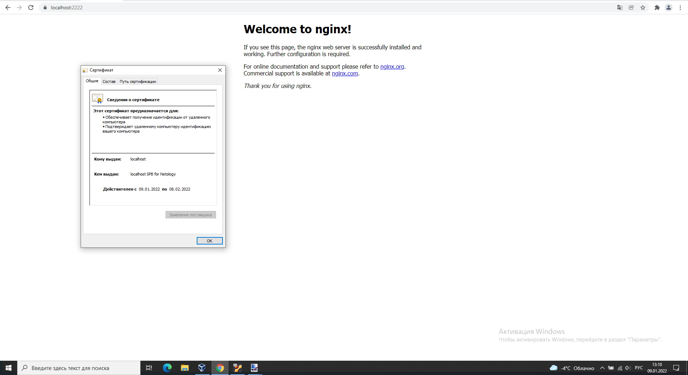
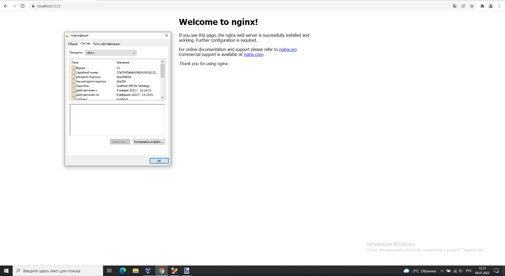

# **Процесс установки и настройки ufw**

# **Процесс установки и выпуска сертификата с помощью hashicorp vault**
#### **Выносим конфидециальные данные в отдельный файл и настраиваем права доступа к файлу. Также назначаем переменные. Запускаем сервер hashicorp vault**
```
vim vault.token        # в этот файл записываем токен vault
chmod 600 vault.token
export VAULT_TOKEN=$(<vault.token)
export VAULT_ADDR=http://127.0.0.1:8200
vault server -dev -dev-root-token-id $VAULT_TOKEN
```
#### **Генерируем корневой (название CA_localhost) сертификат**
```
curl --header "X-Vault-Token: $VAULT_TOKEN" \
   --request POST \
   --data '{"type":"pki"}' \
   $VAULT_ADDR/v1/sys/mounts/pki

curl --header "X-Vault-Token: $VAULT_TOKEN" \
   --request POST \
   --data '{"max_lease_ttl":"87600h"}' \
   $VAULT_ADDR/v1/sys/mounts/pki/tune

tee payload.json <<EOF
{
  "common_name": "CA_localhost",
  "ttl": "87600h"
}
EOF

curl --header "X-Vault-Token: $VAULT_TOKEN" \
   --request POST \
   --data @payload.json \
   $VAULT_ADDR/v1/pki/root/generate/internal \
   | jq -r ".data.certificate" > CA_cert_new.crt

tee payload-url.json <<EOF
{
  "issuing_certificates": "$VAULT_ADDR/v1/pki/ca",
  "crl_distribution_points": "$VAULT_ADDR/v1/pki/crl"
}
EOF

curl --header "X-Vault-Token: $VAULT_TOKEN" \
   --request POST \
   --data @payload-url.json \
   $VAULT_ADDR/v1/pki/config/urls
```  
### **Генерируем промежуточный сертификат (название localhost SPB for Netology)**
``` 
curl --header "X-Vault-Token: $VAULT_TOKEN" \
   --request POST \
   --data '{"type":"pki"}' \
   $VAULT_ADDR/v1/sys/mounts/pki_int

curl --header "X-Vault-Token: $VAULT_TOKEN" \
   --request POST \
   --data '{"max_lease_ttl":"43800h"}' \
   $VAULT_ADDR/v1/sys/mounts/pki_int/tune

tee payload-int.json <<EOF
{
  "common_name": "localhost SPB for Netology"
}
EOF

curl --header "X-Vault-Token: $VAULT_TOKEN" \
   --request POST \
   --data @payload-int.json \
   $VAULT_ADDR/v1/pki_int/intermediate/generate/internal | jq -r  '.data.csr' > pki_int.csr

cat pki_int.csr | jq --raw-input --slurp --compact-output >test.csr
pki_full=$(<test.csr)

tee payload-int-cert.json <<EOF
{
  "csr": $pki_full,
  "format": "pem_bundle",
  "ttl": "43800h"
}
EOF

curl --header "X-Vault-Token: $VAULT_TOKEN" \
   --request POST \
   --data @payload-int-cert.json \
   $VAULT_ADDR/v1/pki/root/sign-intermediate | jq -r  '.data.certificate' > cert.crt

cat cert.crt | jq --raw-input --slurp --compact-output >test.crt
value_certificate=$(<test.crt)

tee payload-signed.json <<EOF
{
  "certificate": $value_certificate
}
EOF

curl --header "X-Vault-Token: $VAULT_TOKEN" \
     --request POST \
     --data @payload-signed.json \
     $VAULT_ADDR/v1/pki_int/intermediate/set-signed
``` 
### **Создаём роль для настройки параметров и контроля сертификатов**
``` 
tee payload-role.json <<EOF
{
  "allowed_domains": "localhost",
  "allow_subdomains": true,
  "max_ttl": "720h"
}
EOF

curl --header "X-Vault-Token: $VAULT_TOKEN" \
    --request POST \
    --data @payload-role.json \
    $VAULT_ADDR/v1/pki_int/roles/example-dot-com
```
### **Запрашиваем сертификат и преобразуем полученные данные в промежуточный сертификат + полученный по запросу сертификат и приватный ключ**
``` 
curl --header "X-Vault-Token: $VAULT_TOKEN" \
    --request POST \
    --data '{"common_name": "localhost", "ttl": "720h"}' \
    $VAULT_ADDR/v1/pki_int/issue/example-dot-com | jq > test.localhost.crt 

cat test.localhost.crt | jq -r .data.certificate > localhost.crt
cat test.localhost.crt | jq -r .data.issuing_ca >> localhost.crt
cat test.localhost.crt | jq -r .data.private_key > localhost.key
```
## **Процесс установки и настройки сервера nginx**
### **После установки nginx, создаём файл виртуального хоста (см. настройки)**
```
root@iurii7777-VirtualBox:/etc/nginx/conf.d# cat configure.conf 
server {
    listen              443 ssl;
    server_name         localhost;
    ssl_certificate     /etc/nginx/ssl/localhost.crt;
    ssl_certificate_key /etc/nginx/ssl/localhost.key;
    ssl_protocols       TLSv1 TLSv1.1 TLSv1.2;
    ssl_ciphers         HIGH:!aNULL:!MD5;
}
```
### **Затем создаём каталог /etc/nginx/ssl/ и копируем в него ранее полученные сертификаты сертификаты, перезапускаем сервис**
```
sudo cp localhost.crt /etc/nginx/ssl
sudo cp localhost.key /etc/nginx/ssl

systemctl restart nginx.service
```
## **Страница сервера nginx в браузере хоста не содержит предупреждений**
### **Пробрасываем порт с виртуальной машины на хост**

### **Устанавливаем корневой сертификат CA_localhost на хостовую машину и проводим тестирование. Ошибок нет**



## **Скрипт генерации нового сертификата**
### **Проверяем что службы в статусе ACTIVE. Переводим службы nginx и vault в состояние ENABLED.**

### **В скрипте не используем sudo, так как он будет запускаться под root. Также определяем переменные для дальнейшей возможности запуска через планировщик cronetab.**
```
#!/bin/bash

export VAULT_ADDR=http://127.0.0.1:8200
export VAULT_TOKEN=$(<vault.token)

/usr/bin/curl --header "X-Vault-Token: $VAULT_TOKEN" \
    --request POST \
    --data '{"common_name": "localhost", "ttl": "720h"}' \
    $VAULT_ADDR/v1/pki_int/issue/example-dot-com | jq > test.localhost.crt

cat test.localhost.crt | jq -r .data.certificate > localhost.crt
cat test.localhost.crt | jq -r .data.issuing_ca >> localhost.crt
cat test.localhost.crt | jq -r .data.private_key > localhost.key

cp localhost.crt /etc/nginx/ssl
cp localhost.key /etc/nginx/ssl

systemctl restart nginx.service
```
## **Crontab работает**
### **Устанавливаем и создаём задание в Crontab (sudo crontabe -e). Для примера используем настройки, чтобы сертификат генерировался каждую 15 минуту каждого часа и проверяем**
```
PATH=/usr/local/sbin:/usr/local/bin:/usr/sbin:/usr/bin:/sbin:/bin:/snap/bin

15 * * * * /bin/bash /root/install_cert.sh >/dev/null 2>&1
```
### **Скриншоты проверки**


