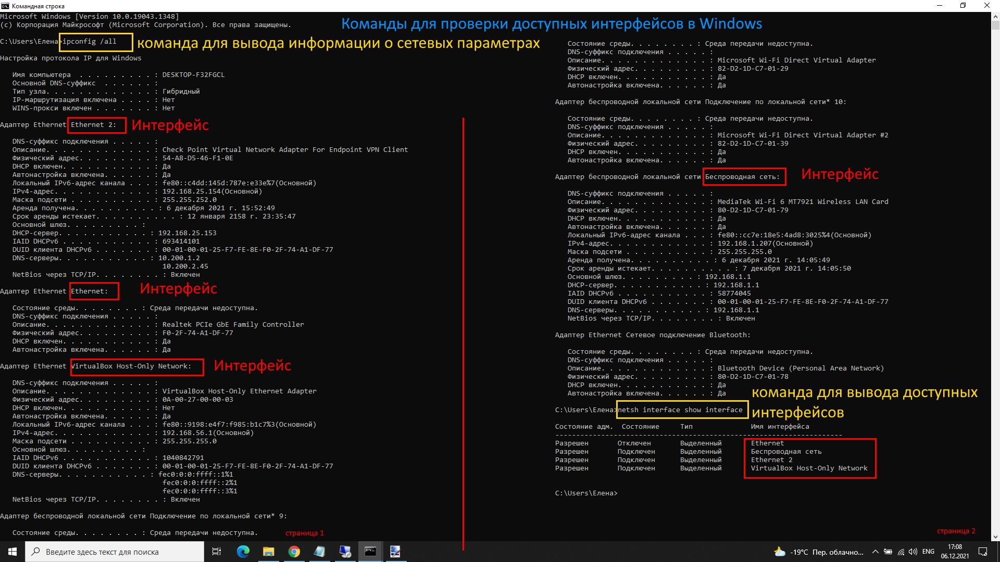
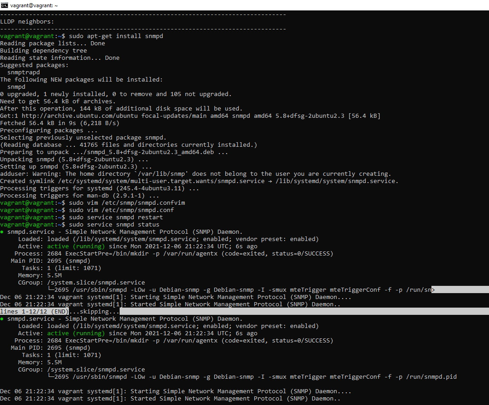
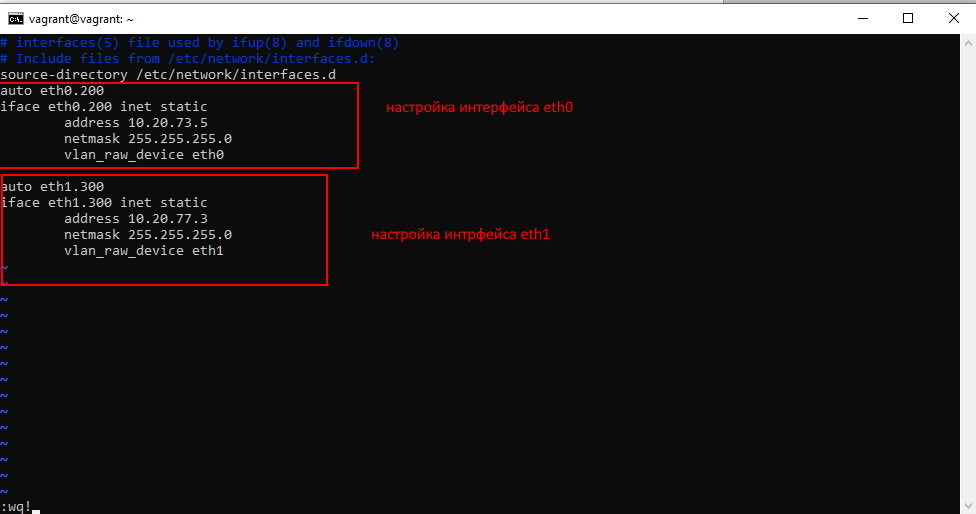
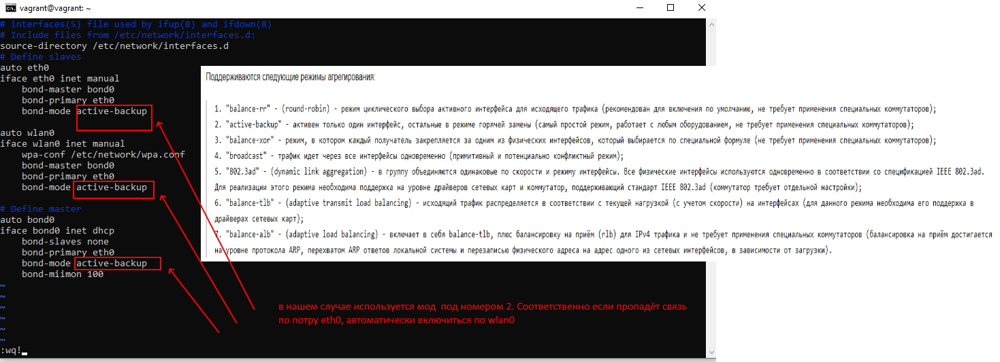

## **Задание 1 **

### **Часть № 1**

***
### **Часть № 2**

## **Задание 2 **
### **Часть № 1**

***
### **Часть № 2**

## **Задание 3**

### **Часть № 1**

***
### **Часть № 2**

## **Задание 4**

### **Часть № 1**

***
### **Часть № 2**

## **Задание 5**

##### В маске /29 всего 8 ip адресов, но два из них служебные. Тоесть рабочих адресов всего 6.
##### /29 подсетей можно получить из сети с маской /24 всего 32 шт. Примеры:
##### 10.10.10.0 /29
##### 10.10.10.8 /29
##### 10.10.10.16 /29
##### 10.10.10.24 /29
##### и т.д.

## **Задание 6**

##### Ip адреса можно взять из подсети 100.64.0.0 /10
##### Для организации стыка между 2-мя организациями можно взять подсеть 100.64.73.0 /24 и разделить её на 4 подсети:
##### 100.64.73.0 /26
##### 100.64.73.64 /26
##### 100.64.73.128 /26
##### 100.64.73.192 /26

## **Задание 7**

