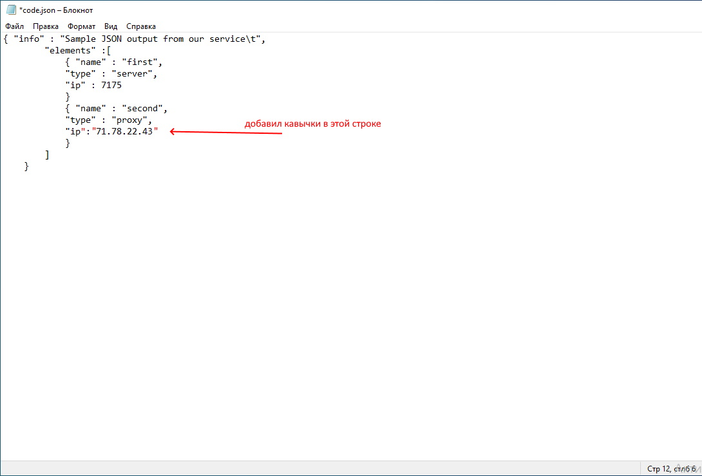
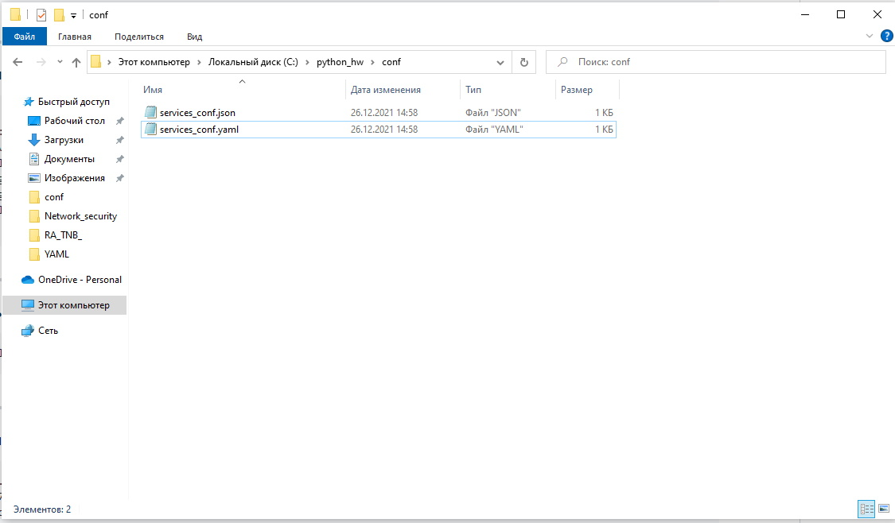

## **Задание 1**



## **Задание 2**

### **Мой скрипт:**
```
import socket
import time as t
import json
import yaml

site = {'drive.google.com':'0.0.0.0', 'mail.google.com':'0.0.0.0', 'google.com':'0.0.0.0'}

a = 1
counter = 0
timeout = 3
fpath = "C:\\python_hw\\conf\\"

def my_script():
    i = 0
    while i != 3:
        for host in site:
            ip = socket.gethostbyname(host)
            if ip != site[host]:
                print(' [ERROR] ' + str(host) + ' IP mistmatch: ' + site[host] + ' ' + ip)
                site[host] = ip
                i += 1
                t.sleep(timeout)
        break

def my_convert():
    with open(fpath+"services_conf.json", 'w') as js:
        json_data = json.dumps(site)
        js.write(json_data)
    with open(fpath+"services_conf.yaml", 'w') as ym:
        yaml_data = yaml.dump(site)
        ym.write(yaml_data)
    t.sleep(timeout)

while counter != 100:
    counter += 1
    my_script()
    my_convert()
```
***
### **Вывод скрипта при запуске:**
```
>>> 
= RESTART: C:/Users/Елена/Desktop/Обучение DevOps/YAML/script опроса IP сайтов3.py
 [ERROR] drive.google.com IP mistmatch: 0.0.0.0 173.194.221.194
 [ERROR] mail.google.com IP mistmatch: 0.0.0.0 173.194.222.18
 [ERROR] google.com IP mistmatch: 0.0.0.0 74.125.205.139
 [ERROR] google.com IP mistmatch: 74.125.205.139 74.125.205.113
 [ERROR] mail.google.com IP mistmatch: 173.194.222.18 173.194.222.17
>>> 
```
***
### **json-файл(ы), который(е) записал скрипт:**
```
{"drive.google.com": "173.194.221.194", "mail.google.com": "173.194.222.17", "google.com": "74.125.205.113"}
```
***
### **yml-файл(ы), который(е) записал скрипт:**
```
drive.google.com: 173.194.221.194
google.com: 74.125.205.113
mail.google.com: 173.194.222.17
```
### **Скриншот расположения файлов:**

