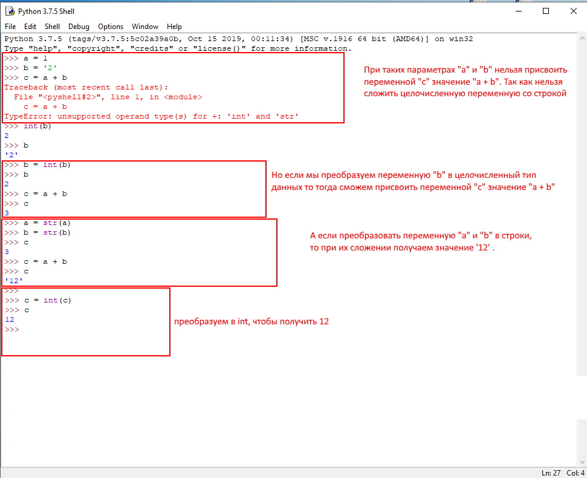

## **Задание 1**



## **Задание 2**

### **Мой скрипт:**
```
#!/usr/bin/env python3
import os

bash_command = ["cd ~/devops-netology", "git status"]
result_os = os.popen(' && '.join(bash_command)).read()
link = ["cd ~/devops-netology", "pwd"]
link_absolut = os.popen(' && '.join(link)).read()
prepare_link = link_absolut.replace('\n', '')
for result in result_os.split('\n'):
    if result.find('изменено') != -1:
        prepare_result = result.replace('\tизменено:      ', '')
        print(prepare_link + '/' + prepare_result)
```
***
### **Вывод результата:**
```
/home/iurii/devops-netology/devops-netology (изменено содержимое)
/home/iurii/devops-netology/python/devops_3
/home/iurii/devops-netology/python/test
/home/iurii/devops-netology/python/test_777
```
## **Задание 3** 

### **Мой скрипт:**

***
### **Вывод результата:**

## **Задание 4**

### **Мой скрипт:**

***
### **Вывод результата:**


